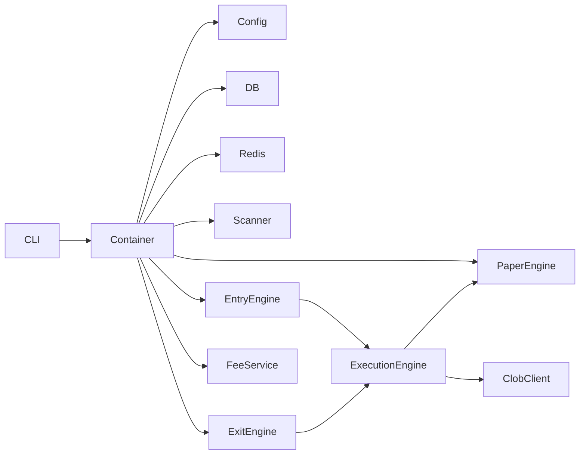

# Polynavbot

Polymarket longshot trading bot with paper simulation, fee-aware PnL, backtesting, scheduled jobs, and gated live CLOB infrastructure. Default mode is **paper** — no real orders unless explicitly configured.

## Prerequisites

- [Node.js](https://nodejs.org/) 20+
- [pnpm](https://pnpm.io/)
- PostgreSQL and Redis (via [Docker Compose](#infrastructure) or existing host services)

## Quick Start

### 1. Install dependencies

```bash
pnpm install
```

> **Note:** This project includes `pnpm-workspace.yaml` with `allowBuilds` entries so Prisma and other native dependencies can run install scripts under pnpm 10+.

### 2. Configure environment

```bash
cp .env.example .env
```

Edit `.env` if needed. Defaults use `TRADING_MODE=paper` and `PAPER_STARTING_BALANCE_USD=500`. No Polymarket wallet credentials are required for paper mode.

### 3. Infrastructure

**Option A — Docker Compose**

```bash
docker compose up -d
docker compose ps   # both containers should be "running"
```

**Option B — Existing host services**

If PostgreSQL and Redis are already running on `localhost:5432` and `localhost:6379`, skip Docker. Ensure `.env` matches your connection URLs.

> **Port conflicts:** If `docker compose up` fails with `address already in use` on 6379 or 5432, either stop the host services or change the published ports in `docker-compose.yml` and update `DATABASE_URL` / `REDIS_URL`.

### 4. Run database migrations

```bash
pnpm prisma:migrate
```

### 5. Verify services

```bash
pnpm dev -- health
```

Expected output: JSON with `"status": "healthy"` for PostgreSQL and Redis.

## Paper Trading

One-shot full pipeline (scan → score → place orders → simulate fills):

```bash
pnpm paper:run --max-pages 1 --limit-per-page 20
```

> Pass flags **directly** after the script name. Do **not** insert `--` before options (that breaks Commander parsing).

| Command | Description |
|---------|-------------|
| `pnpm paper:run` | Scan, score, place paper orders, simulate fills |
| `pnpm entry:paper` | Entry only — passive BUY orders via entry engine |
| `pnpm exit:paper` | Exit only — partial exits, trailing stop, etc. |
| `pnpm positions:update` | Mark open positions to market |
| `pnpm report` | Write `reports/latest.md`, `latest.json`, `trades.csv` |
| `pnpm dashboard` | Live browser dashboard (auto-refreshing) |
| `pnpm scan` | Scan markets only (no trading) |

All paper commands require `TRADING_MODE=paper`.

### Continuous paper trading (scheduled jobs)

Run the worker continuously. Register schedules once with `pnpm scheduler` (it exits after writing cron jobs to Redis):

```bash
# Terminal 1 — keep running (processes jobs)
pnpm worker

# One-time — register recurring scan/entry/exit jobs
pnpm scheduler
```

Optional real-time WebSocket monitor (paper mode only):

```env
WS_ENABLED=true
```

```bash
pnpm ws:monitor
```

### Live dashboard

Run alongside `pnpm worker` in a separate terminal:

```bash
pnpm dashboard
```

Open **http://127.0.0.1:3847** in your browser. The page auto-refreshes every 10 seconds (configurable).

```bash
pnpm dashboard --port 3847 --refresh 5
```

Shows portfolio summary, open positions, recent signals/trades, pending exits, and risk rejections.

### Portfolio report (one-shot)

```bash
pnpm report
```

Reports include gross/net PnL, fees paid, maker/taker trade counts, and open positions.

## Backtesting

```bash
pnpm backtest --start 2025-01-01 --end 2025-06-01 --fee-mode mixed
```

Backtests load price history from local snapshots when available, then fall back to stored outcomes, then to the Polymarket Gamma + CLOB APIs for the requested date range. No prior paper-trading run is required, but the first run may take a few minutes while markets and CLOB history are fetched. Tune `BACKTEST_MAX_MARKETS` in `.env` to cap how many markets are discovered from Gamma (default `100`).

Mirror a known wallet's YES longshot book (e.g. [NyetRisk](https://polymarket.com/0xc03ce4d8af842ca6251ac57228b3ffb166ed50af)):

```bash
pnpm backtest --start 2025-06-01 --end 2026-06-26 \
  --mirror-wallet 0xc03ce4d8af842ca6251ac57228b3ffb166ed50af
```

Fee modes: `maker_only`, `taker_only`, `mixed` (default), `actual_if_available`.

## Scripts

| Script | Description |
|--------|-------------|
| `pnpm dev` | Development mode with hot reload |
| `pnpm build` | Compile TypeScript to `dist/` |
| `pnpm start` | Run compiled production build |
| `pnpm test` | Run Vitest suite |
| `pnpm lint` | ESLint |
| `pnpm typecheck` | Type-check without emit |
| `pnpm prisma:migrate` | Apply Prisma migrations |
| `pnpm prisma:studio` | Prisma Studio GUI |
| `pnpm paper:run` | One-shot paper trading run |
| `pnpm entry:paper` | Paper entry engine |
| `pnpm exit:paper` | Paper exit engine |
| `pnpm positions:update` | Update position marks |
| `pnpm report` | Generate portfolio reports |
| `pnpm dashboard` | Live browser dashboard |
| `pnpm backtest` | Historical backtest |
| `pnpm worker` | BullMQ worker (paper mode) |
| `pnpm scheduler` | Register scheduled jobs (paper mode) |
| `pnpm ws:monitor` | WebSocket price monitor (paper mode) |

CLI options (examples):

```bash
pnpm paper:run --max-pages 5 --limit-per-page 50
pnpm entry:paper --max-pages 1 --limit-per-page 20
pnpm scan --max-pages 1 --limit-per-page 20
pnpm backtest --start 2025-01-01 --end 2025-06-01 --fee-mode mixed
```

## Project Structure

```
src/
├── config/        # Zod env validation, live trading guards
├── db/            # Prisma client, repositories
├── fees/          # Polymarket fee calculation
├── logger/        # Pino logger (with secret redaction)
├── polymarket/    # CLOB, Gamma API, WebSocket clients
├── scanner/       # Longshot market scanner
├── strategy/      # Longshot scorer
├── risk/          # Risk engine (limits, stale data)
├── execution/     # Entry/exit engines, execution routing
├── paper/         # Paper trading simulator
├── backtest/      # Historical backtest engine
├── report/        # Terminal and file reports
├── dashboard/     # Live HTTP dashboard
├── positions/     # Position monitor
├── jobs/          # Redis + BullMQ workers
├── cli/           # Commander CLI commands
├── container.ts   # Dependency injection
└── index.ts       # Entry point
```

## Architecture

Services are constructed via `AppContainer` (`src/container.ts`), which lazily initializes injectable dependencies. Each module exposes an interface so implementations can be swapped in tests.



## Environment Variables

Configuration is validated at startup via Zod (`src/config/env.ts`). See [`.env.example`](.env.example) for all variables.

### Trading mode

| Value | Description |
|-------|-------------|
| `paper` | Simulated trading only (default) |
| `dry_run` | Evaluate signals; log orders without placing |
| `live` | Live CLOB — requires credentials and confirmation phrase |

When `TRADING_MODE=live`, these are **required**:

- `PRIVATE_KEY`, `DEPOSIT_WALLET_ADDRESS`
- `POLY_API_KEY`, `POLY_API_SECRET`, `POLY_API_PASSPHRASE`

Order placement additionally requires `LIVE_TRADING_CONFIRMATION=I_UNDERSTAND_THE_RISKS`. See [LIVE_TRADING_CHECKLIST.md](LIVE_TRADING_CHECKLIST.md).

For `paper` and `dry_run`, live credentials should remain unset.

### Key variable groups

- **Application** — `NODE_ENV`, `LOG_LEVEL`, `TRADING_MODE`
- **Infrastructure** — `DATABASE_URL`, `REDIS_URL`
- **Polymarket API** — `POLY_CLOB_HOST`, `POLY_GAMMA_API_URL`, WebSocket URLs
- **Strategy / risk** — entry price bounds, spend limits, exposure caps
- **Fees** — `BUILDER_FEE_BPS`, `FEE_PARAMS_REFRESH_HOURS`, `BACKTEST_FEE_MODE`
- **Paper** — `PAPER_STARTING_BALANCE_USD`, `PAPER_PASSIVE_FILL_ON_CROSS`

## Safety

- **Default is paper mode** — live order placement is gated in `clobClient.ts` by mode + confirmation phrase.
- **`entry:paper`, `exit:paper`, `ws:monitor`** require `TRADING_MODE=paper` and cannot place live orders.
- No private keys in this repository; copy `.env.example` to `.env` locally and never commit `.env`.

Further reading:

- [SAFETY_REVIEW.md](SAFETY_REVIEW.md) — audit findings and fixes
- [TEST_PLAN.md](TEST_PLAN.md) — manual and automated test matrix
- [LIVE_TRADING_CHECKLIST.md](LIVE_TRADING_CHECKLIST.md) — pre-flight for live mode

## Development

```bash
pnpm typecheck
pnpm lint
pnpm test
pnpm build
pnpm start -- health
```

# Terminal 1 — processes jobs (scan, entry, exit, position updates)
pnpm worker

# Terminal 2 — schedules recurring jobs
pnpm scheduler

## License

Private — not for public distribution.
