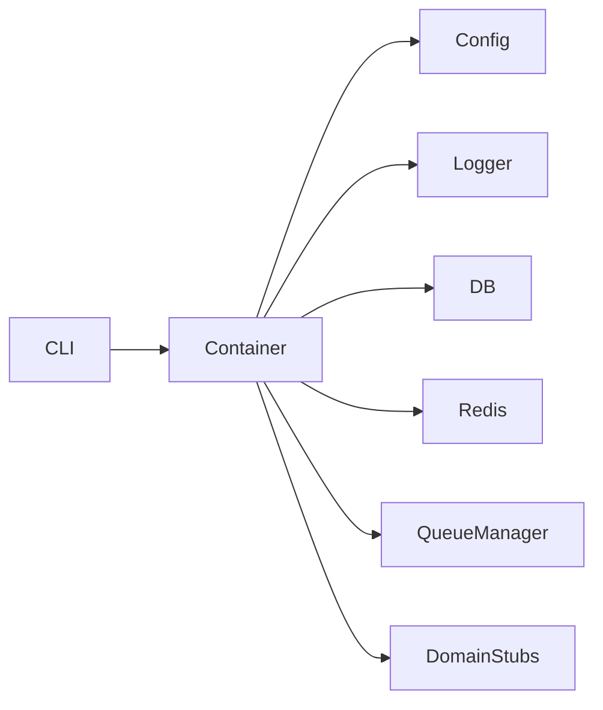

# Polynavbot

Production-grade base architecture for a Polymarket longshot trading bot. This project provides modular, injectable services with PostgreSQL, Redis, and BullMQ — **no live trading is implemented yet**.

## Prerequisites

- [Node.js](https://nodejs.org/) 20+
- [pnpm](https://pnpm.io/)
- [Docker](https://www.docker.com/) and Docker Compose

## Quick Start

### 1. Install dependencies

```bash
pnpm install
```

> **Note:** This project includes `pnpm-workspace.yaml` with `allowBuilds` entries so Prisma and other native dependencies can run install scripts under pnpm 10+.

### 2. Configure environment

```bash
cp .env.example .env
```

Edit `.env` if needed. Default values match the Docker Compose services and use `TRADING_MODE=paper` (safe default).

### 3. Start infrastructure

```bash
docker compose up -d
```

Wait until both `postgres` and `redis` containers are healthy:

```bash
docker compose ps
```

### 4. Run database migrations

```bash
pnpm prisma:migrate
```

### 5. Verify services

```bash
pnpm dev -- health
```

Expected output: JSON report with `"status": "healthy"` for PostgreSQL and Redis.

## Scripts

| Script | Description |
|--------|-------------|
| `pnpm dev` | Run in development mode with hot reload |
| `pnpm build` | Compile TypeScript to `dist/` |
| `pnpm start` | Run compiled production build |
| `pnpm prisma:migrate` | Apply Prisma migrations |
| `pnpm prisma:studio` | Open Prisma Studio GUI |
| `pnpm lint` | Run ESLint |
| `pnpm typecheck` | Type-check without emitting |

## Project Structure

```
src/
├── config/        # Zod env validation
├── db/            # Prisma client wrapper
├── logger/        # Pino logger
├── polymarket/    # Polymarket API client (stub)
├── scanner/       # Longshot market scanner (stub)
├── strategy/      # Entry/exit rules (stub)
├── risk/          # Risk management (stub)
├── execution/     # Order execution — paper only (stub)
├── paper/         # Paper trading simulator (stub)
├── positions/     # Position tracking (stub)
├── jobs/          # Redis + BullMQ queue manager
├── utils/         # Shared utilities
├── cli/           # Commander CLI commands
├── container.ts   # Dependency injection container
└── index.ts       # Application entry point
```

## Architecture

Services are constructed via `AppContainer` (`src/container.ts`), which lazily initializes injectable dependencies. Each module exposes an interface (e.g. `ILogger`, `IDbClient`) so implementations can be swapped in tests.



## Environment Variables

Configuration is validated at startup via Zod (`src/config/env.ts`). Copy [`.env.example`](.env.example) and adjust as needed.

### Trading mode

| Value | Description |
|-------|-------------|
| `paper` | Simulated trading only (default) |
| `dry_run` | Evaluate signals without placing orders |
| `live` | Live trading — requires all credential variables below |

When `TRADING_MODE=live`, these variables are **required**:

- `PRIVATE_KEY`
- `DEPOSIT_WALLET_ADDRESS`
- `POLY_API_KEY`
- `POLY_API_SECRET`
- `POLY_API_PASSPHRASE`

Order placement additionally requires `LIVE_TRADING_CONFIRMATION=I_UNDERSTAND_THE_RISKS`. Read-only CLOB calls (`getOpenOrders`, `getTrades`) and cancellations work in live mode without the confirmation phrase.

For `paper` and `dry_run`, live credentials are optional and should remain unset or commented out.

### Variable groups

- **Application** — `NODE_ENV`, `LOG_LEVEL`, `TRADING_MODE`
- **Infrastructure** — `DATABASE_URL`, `REDIS_URL`
- **Polymarket API** — `POLY_CLOB_HOST`, `POLY_GAMMA_API_URL`, `POLY_DATA_API_URL`, WebSocket URLs, `POLY_CHAIN_ID`
- **Strategy / risk** — spend limits, entry price bounds, liquidity filters (defaults provided in `.env.example`)

Validation errors are grouped by section and printed at startup if `.env` is misconfigured.

## Safety

- **No private keys** are stored in this repository.
- **Default is paper mode** — live CLOB infrastructure exists in `src/polymarket/clobClient.ts` but is gated by `TRADING_MODE=live` and a confirmation phrase for order placement.
- Copy `.env.example` to `.env` locally; never commit `.env`.

## Development

```bash
# Type check
pnpm typecheck

# Lint
pnpm lint

# Build and run
pnpm build
pnpm start -- health
```

## License

Private — not for public distribution.
